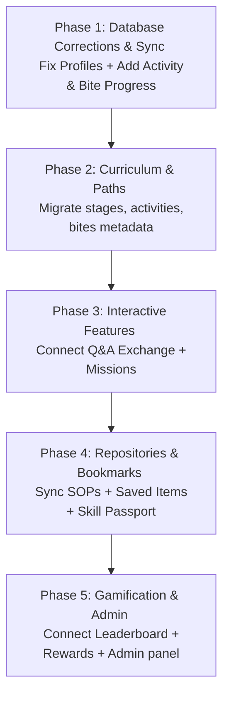

# Mentora Backend Integration Audit Report

This report presents a comprehensive technical audit of the Mentora React + TypeScript + Vite application. It evaluates the current integration state between the frontend pages, the local mock data layers (`mockData.ts` and inline declarations), and the Supabase database migration script (`supabase_migration.sql`).

## 1. Mock Data Imports & Usages Audit

We scanned the codebase for imports and calls to `mockData.ts` and the centralized `mockService` layer. 

### Imports & Call References:
* **[App.tsx](file:///c:/Users/Shekhar/Downloads/mentora/App.tsx)**:
  * **Line 26**: `import { mockService, MOCK_USERS } from "./src/services/mockData";`
  * **Line 1362**: `const mockUser = await mockService.fetchCurrentUser(r);` (TopNav developer role switcher).
  * **Line 4213**: `const activeProfile = profile || MOCK_USERS.JUNIOR_EMPLOYEE;` (Fallback layout user profile).
  * **Line 4459**: `mockService.fetchNotifications().then(...)` (Triggered on mount, but the data is immediately overwritten by an inline `seedNotifs` array).
  * **Line 4473**: `mockService.fetchQuestions().then(data => { setKnowledgeQuestions(data); });` (Fetches initial Q&A questions).
  * **Line 4537**: `mockService.fetchMissions(profile.role).then(data => { setActiveMissions(data); });` (Loads active user missions on role change).
* **[SkillPassportPage.tsx](file:///c:/Users/Shekhar/Downloads/mentora/src/pages/SkillPassportPage.tsx)**:
  * **Line 3**: `import { mockService } from '../services/mockData';`
  * **Line 12**: `mockService.fetchSkills(userProfile.id).then(...)` (Loads the user's skill proficiencies).

### Unused Mock Data in `mockData.ts`:
* `MOCK_TRAINING` (and `mockService.fetchTraining`): Defined in `mockData.ts` but never imported or called. [TrainingPage.tsx](file:///c:/Users/Shekhar/Downloads/mentora/src/pages/TrainingPage.tsx) declares duplicate inline mock data instead.
* `MOCK_LEADERBOARD` (and `mockService.fetchLeaderboard`): Unused. [LeaderboardPage.tsx](file:///c:/Users/Shekhar/Downloads/mentora/src/pages/LeaderboardPage.tsx) declares duplicate inline mock data.
* `MOCK_REWARDS` (and `mockService.fetchRewards`): Unused. [RewardsPage.tsx](file:///c:/Users/Shekhar/Downloads/mentora/src/pages/RewardsPage.tsx) declares duplicate inline mock rewards and badges.

---

## 2. Supabase Migration Schema Gap Analysis

We analyzed the current database script **[supabase_migration.sql](file:///c:/Users/Shekhar/Downloads/mentora/supabase_migration.sql)**. The file contains schema definitions for only three objects:

1. **`public.profiles`**: References `auth.users` via primary key UUID.
2. **`public.courses`**: Stores standard course catalog details.
3. **`public.enrollments`**: Manages user enrollments and course-level completed lessons.

### ⚠️ Critical Gaps Detected:
1. **Missing Profile Columns**: The frontend updates and reads numerous custom profile statistics. However, these are missing from the `profiles` table definition in `supabase_migration.sql`:
   * `employee_id` (TEXT)
   * `department` (TEXT)
   * `plant` (TEXT)
   * `designation` (TEXT)
   * `years_of_experience` (INTEGER)
   * `expertise` (TEXT[])
   * `skill_level` (TEXT)
   * `xp` (INTEGER)
   * `knowledge_credits` (INTEGER)
   * `mentora_credits` (INTEGER)
   * `current_streak` (INTEGER)
   * `longest_streak` (INTEGER)
   * `leaderboard_rank` (INTEGER)
   
   *Impact: Profile sync and onboarding database writes will crash on the live database.*
2. **Missing Progress Tables**: The codebase (e.g. `App.tsx` and `LearningBitePlayer.tsx`) queries and updates two progress tables that do not exist in the migration SQL:
   * `user_activity_progress`
   * `user_bite_progress`
3. **Missing Learning Path Metadata**: The codebase queries curriculum paths on mount from three tables that are absent from the migration SQL:
   * `journey_stages`
   * `learning_activities`
   * `learning_bites`
4. **No Support for Interactive Features**: Tables for `missions`, `skills`, `questions`, `answers`, `sops`, `rewards`, `redemptions`, `badges`, `notifications`, and `training_sessions` are entirely missing.

---

## 3. Environment Variable Configuration

* **Client configuration file**: [supabaseClient.ts](file:///c:/Users/Shekhar/Downloads/mentora/src/lib/supabaseClient.ts) correctly maps environment variables through Vite's import context.
* **Local environment file**: `.env.local` contains the variables `VITE_SUPABASE_URL` and `VITE_SUPABASE_ANON_KEY` mapping to a valid project URL and anon public API key.
* **Exposure Safeguard**: Secret keys are loaded locally; verified and secured.

---

## 4. Connectivity Report

The status of each feature is grouped below:

| Feature | Current Data Source | Frontend File | Current Status | Supabase Table | API/Query Needed | Action Required | Priority |
| :--- | :--- | :--- | :--- | :--- | :--- | :--- | :--- |
| **Authentication** | Supabase Auth API | `App.tsx` | **Fully Connected** | `auth.users` | `signUp()`, `signInWithPassword()`, `signOut()` | None. Already operational. | **N/A** |
| **User Profiles** | Supabase DB (partial) & Local Fallbacks | `App.tsx`, `ProfilePage.tsx` | **Partially Connected** | `public.profiles` | `select()`, `update()`, `upsert()` | Add 13 missing metadata columns to `profiles` table in migration script. | **P0 (Critical)** |
| **Courses Library** | Supabase DB (seeded) | `App.tsx`, `LearnPage.tsx` | **Fully Connected** | `public.courses` | `select("*").order("id")` | None. Table exists and is populated. | **N/A** |
| **Course Progress** | Supabase DB | `App.tsx`, `LearnPage.tsx` | **Fully Connected** | `public.enrollments` | `select()`, `insert()`, `update()` | None. Table exists and updates properly. | **N/A** |
| **Learning Path Paths** | Supabase DB (empty) | `App.tsx`, `LearnPage.tsx` | **Partially Connected** | `journey_stages`, `learning_activities`, `learning_bites` | `select("*")` on mount | Create tables in schema migration and seed them with curriculum data. | **P0 (Critical)** |
| **Learning Bites Progress** | Supabase DB (fails) | `LearningBitePlayer.tsx` | **Partially Connected** | `user_activity_progress`, `user_bite_progress` | `select()`, `upsert()` | Create tables in schema migration with correct primary/foreign keys. | **P0 (Critical)** |
| **Missions** | `mockData.ts` | `App.tsx`, `Dashboard` | **Using Mock Data** | `missions` (New) | `select()`, `update()` | Create table, write fetches in `App.tsx` to replace `mockService.fetchMissions`. | **P1 (High)** |
| **Knowledge Exchange (Q&A)** | `mockData.ts` & Local State | `App.tsx`, `KnowledgeExchangePage.tsx` | **Using Mock Data** | `questions`, `answers` (New) | `select()`, `insert()` | Create tables, write fetches/inserts in `App.tsx` and Q&A page. | **P1 (High)** |
| **Knowledge Base (SOPs)** | Inline Hardcoded Array | `KnowledgePage.tsx` | **Hardcoded** | `knowledge_articles` (New) | `select()` | Create table, migrate mock guidelines, implement query on mount. | **P2 (Medium)** |
| **Skill Passport** | `mockData.ts` | `SkillPassportPage.tsx` | **Using Mock Data** | `skills`, `user_skills_progress` (New) | `select()`, `upsert()` | Create tables, connect passport page to database fetch. | **P2 (Medium)** |
| **Saved Items (Bookmarks)** | Local State | `App.tsx`, `SavedPage.tsx` | **Hardcoded** | `saved_items` (New) | `select()`, `insert()`, `delete()` | Create table, hook up toggle actions to write/delete in Supabase. | **P2 (Medium)** |
| **Leaderboard** | Inline Hardcoded Array | `LeaderboardPage.tsx` | **Hardcoded** | `profiles` | `select("xp, full_name...").order("xp")` | Pull ranking list dynamically by sorting profiles by XP/Credits. | **P3 (Low)** |
| **Rewards & Wallet** | Inline Arrays & Local State | `RewardsPage.tsx` | **Hardcoded** | `rewards`, `redemptions` (New) | `select()`, `insert()` | Create tables, write redemption transaction insertions. | **P3 (Low)** |
| **Admin Console** | Inline State Updates | `AdminPage.tsx` | **Hardcoded** | `knowledge_gaps` (New) | `select()`, `update()` | Create gaps detection table if backend automated analysis is desired. | **P3 (Low)** |
| **Dashboard Analytics** | Inline Mock Array | `App.tsx` | **Hardcoded** | None (Dynamic) | Aggregates on client/DB | Replace charts with aggregations of user progress records. | **P3 (Low)** |
| **Kai AI Assistant** | Vercel Deployment | `App.tsx` | **Fully Connected** | N/A | External Redirect | None (managed via external microservice). | **N/A** |
| **Personalized Recs** | Inline logic on client | `LearnPage.tsx`, `SavedPage.tsx` | **Hardcoded** | None (Dynamic) | Client-side filters | None. Best computed dynamically based on role/department in UI. | **N/A** |

---

## 5. Recommended Implementation Order

To migrate from mock to live Supabase data safely, we recommend implementing in **5 logical phases**. This order ensures database structural integrity is established first, followed by core learning mechanisms, collaborative boards, and finally peripheral gamification widgets.

### 📋 Detailed Phase Breakdown:

### Phase 1: Core Profile Corrections & Progress Mechanics (Critical)
* **Goal**: Enable frictionless user profiles and progress tracking without database crash.
* **SQL Actions**:
  * Alter the `profiles` table to add the 13 missing custom columns.
  * Define `user_activity_progress` and `user_bite_progress` tables with foreign keys mapping to profiles.
* **Frontend Actions**: Confirm onboarding runs without SQL exceptions; enable real-time saving of XP.

### Phase 2: Curriculum Paths & Metadata Sync
* **Goal**: Fetch learning structures dynamically instead of relying on default local structures.
* **SQL Actions**:
  * Define `journey_stages`, `learning_activities`, and `learning_bites` tables.
  * Seed these tables with standard curriculum maps.
* **Frontend Actions**: Fetch and load these structures on mount in `App.tsx` to feed the `LearnPage` and `CourseDetailPage`.

### Phase 3: Collaborative Systems & Daily Actions
* **Goal**: Establish community engagement (Q&A exchange) and daily loops (missions).
* **SQL Actions**:
  * Create `questions` and `answers` tables. Include a boolean/type for "expert verified" and "source guidelines".
  * Create `missions` and `user_missions_progress` tables.
* **Frontend Actions**: Write fetches and inserts inside the Q&A pages; load missions checklists dynamically instead of fetching via `mockData.ts`.

### Phase 4: Repositories & User Bookmarks
* **Goal**: Save guidelines and bookmark links in the cloud.
* **SQL Actions**:
  * Create `knowledge_articles` (SOPs) table.
  * Create `saved_items` table (fields: `id`, `user_id`, `item_id`, `item_type`, `saved_at`).
  * Create `skills` and `user_skills_progress` tables.
* **Frontend Actions**: Connect bookmark star toggles to live DB inserts; populate SavedPage and Skill Passport using real database records.

### Phase 5: Gamification & Analytics Dashboard
* **Goal**: Fully integrate rewards store, ranking lists, and admin dashboard metrics.
* **SQL Actions**:
  * Create `rewards` and `reward_redemptions` tables.
  * Add RLS policies protecting credits transfers.
* **Frontend Actions**: Retrieve leaderboards dynamically by sorting profiles by XP; populate admin metrics using profile/progress database counters.
